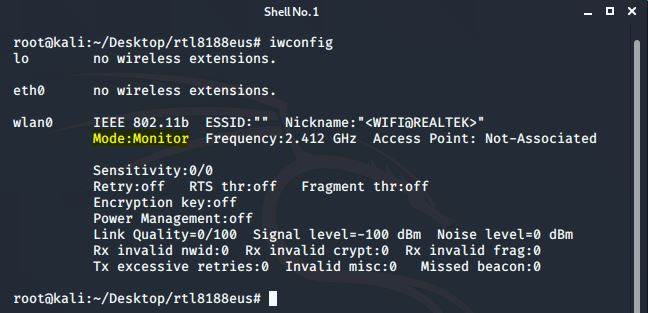

# Cracking-WEP
## Mô tả
WEP là viết tắt của từ “Wired Equivalent Privacy” và một trong những giao thức bảo mật đầu tiên cho WiFi. Hiện nay, WEP đã không còn sử dụng rộng rãi bởi vì "tuổi tác" của nó kèm theo những lỗ hỏng được phát hiện làm cho nó trở thành một lựa chọn không an toàn cho việc mã hóa.Bây giờ, mọi người có thể tải xuống các công cụ tự động làm việc này cho họ. Họ trỏ chương trình tới mạng hỗ trợ WEP, để nó theo dõi pattern và tự bẻ khóa mật khẩu. Do đó, sử dụng kết nối dựa trên WEP trong thời đại ngày nay là rất nguy hiểm.

Trong dự án cuối kì, ta sử dụng một số công cụ crack WEP phổ biến như:
  * Aireplay-ng - Công cụ bẻ khóa mã hóa WEP dựa trên Perl phổ biến nhất
  * Aircrack-ng - ARP giả mạo / tiêm bằng cách sử dụng aireplay-ng
  * Kismet - Network Sniffer, cũng có thể lấy IV
  * Airodump - GrabbingIVs
  * Commview - Bắt các gói trong Windows

Môi trường thực hành dự án này tuỳ theo OS có hỗ trợ tool đó hay không. Cụ thể:
  * Kali Linux: Aireplay-ng, Aircrack-ng, Airodump, Kismet
  * Window 10: Commview
  
Ngoài ra, nếu thực hành trên máy ảo, ta sẽ cần sự hỗ trợ của card mạng rời.

## Môi trường thực hành
### Hệ điều hành
**Kali linux** 
Thực hiện cài đặt máy ảo trên VMWare. Cấu hình:
- Memory 2 GB
- Processor 2 cores
- Hard Disk 20 GB SSD
- Card mạng rời TL-WN722N

**Window**
Máy thật. Cấu hình:
- Memory 12 GB
- Processor Intel® Core™ i5-7200U
- Hard Disk 500 GB SSD
### Access Point
Thiết lập phương thức bảo mật WEP và chọn key cho Access Point

## Cracking WEP
### Chuẩn bị
Việc đầu tiên cần làm là khởi động chế độ giám sát (monitor mode) trên wireless adapter, để theo dõi giao thông mạng qua lại giữa máy với điểm truy cập mạng (Access Point). Đối với các card mạng TP-Link, ta cần chạy các câu lệnh sau đây trước:
>sudo rmmod r8188eu.ko  
sudo modprobe 8188eu

Sau đó, thực hiện các câu lệnh tiếp theo:
>ifconfig wlan0 down #Tắt card mạng wlan0  
airmon-ng check kill #Tắt hết các tiến trình đang sử dụng card wifi  
iwconfig wlan0 mode monitor #Bật monitor mode  
ifconfig wlan0 up #Bật card mạng wlan0

  
Và kết quả là wireless card đã ở chế độ Monitor.
### Tiến hành bẻ khoá
#### Cracking WEP đơn giản

**Bước 1:** Dò thông tin lưu lượng mạng xung quanh với ***Airodump-ng***. Chạy lệnh sau:
> airodump-ng wlan0

**Lưu ý:** *wlan0* là tên interface của wireless card, tên này có thể khác đối với từng phiên bản hệ điều hành nên cần hiệu chỉnh cho phù hợp.
  
Hiện tại, Adapter không dây ở chế độ Monitor mode nên lệnh này sẽ lấy tất cả thông tin Wifi xung quanh và hiển thị thông tin lên. Mục đích lệnh này là để ta chọn mục tiêu và lấy thông tin về mục tiêu đó. Ta chỉ cần quan tâm 2 cột là BSSID (địa chỉ MAC của thiết bị wifi) và CH (kênh của thiết bị wifi).

**Bước 2:** Tập trung vào mục tiêu được chọn.
>airodump-ng --bssid [mã_bssid] -c [kênh] -w [đường_dẫn_lưu]/[đặt_tên] [interface]

  
Ở đây ta chọn:
- F4:F2:6D:53:7E:BE là BSSID của AP
- -c 1 là kênh mà AP đang hoạt động
- wepcracking là tệp muốn viết
- wlan0 là tên interface không dây

Như trên hình ta tập trung thu thập dữ liệu từ Access Point có ESSID là **Free_Wifi_605**

**Bước 3:** Deauthentication  
Để lấy được dữ liệu, ta cần có client xác thực với Access Point. Như vậy, chúng ta cần huỷ xác thực các client với AP để hệ thống tự xác thực lại, từ đó thu thập thông tin. Từ Terminal khác, ta gõ lệnh:
>aireplay-ng --deauth 100 -a [mã_bssid] [interface]

  
Ở đây ta chọn:
- 100 là số khung bỏ xác thực
- F4:F2:6D:53:7E:BE là BSSID của AP
- wlan0 là tên interface không dây

**Bước 4:** Sau khi thực hiện bước 3, quay lại cửa sổ bước 2 và quan sát.
  
Đã có client kết nối vào lại và airodump-ng bắt đầu thu thập IV. Tuy nhiên, quá trình này thu thập rất chậm. Để đẩy nhanh tiến độ, ta sẽ đến bước tiếp theo.

**Bước 5:** Tăng tín hiệu ARP  
Sử dụng ***aireplay-ng*** để tiêm các gói ARP. Quá trình tiêm các gói ARP (Injecting ARP Packets) nhằm buộc AP liên tục gửi đi các gói dữ liệu chứa khóa IV (Initialization Vector). Quá trình này có thể diễn ra tự động nhưng trên thực tế, nếu có Client đang kết nối và trao đổi dữ liệu với AP, tốc độ thu thập khóa IV càng nhanh nếu lượng dữ liệu trao đổi càng nhiều.  
Mở Terminal khác và chạy lệnh sau:
>aireplay-ng -3 -b [mã_bssid_của_AP] -h [bssid_của_client] [interface]

  
Ở đây ta chọn:
- F4:F2:6D:53:7E:BE là BSSID của AP
- 00:5B:94:33:AC:82 là BSSID của client
- wlan0 là tên interface không dây

  
Quan sát nhận thấy số lượng IV gia tăng rất nhiều. Chỉ khoảng 1 phút đã nhận được 10.000 IV. Giờ ta sẽ đợi đến khi bắt đủ số lượng yêu cầu thì sẽ phân tích và nhận kết quả.

**Bước 6:** Phân tích và lấy kết quả  
Sử dụng câu lệnh sau để phân tích file dữ liệu thu thập
>aircrack-ng wepcracking-01.cap

  
Với khoảng 20.000 IVs thu thập được, ta đã có thể crack được mật khẩu WEP với 64 bit key.

#### Cracking WEP sử dụng Kismet
Tương tự cracking WEP đơn giản. Tuy nhiên ta sẽ tăng độ dài key lên thành 128 bit với mật khẩu là **W3p-ezc@cking**  
**Bước 1:** Sửa file log của kismet để kismet xuất file thông tin bắt được dạng pcapng.
  

Sau đó, chạy lệnh sau:
>kismet -c wlan0

**Bước 2:** Ta sẽ vào browser với địa chỉ local và port 2501. Sau đó tạo tài khoản đăng nhập hệ thống.
  

**Bước 3:** Quan sát traffic mà kismet bắt được và chọn mục tiêu tấn công.
  

**Bước 4:** Chọn channel cố định ứng với mục tiêu cần bẻ khoá để bắt IVs nhanh hơn.
  

**Bước 5:** Quan sát số lượng data bắt được.
  

**Bước 6:** Để thu thập data nhanh hơn, ta sử dụng aireplay-ng như ở bước 5 phần crack WEP đơn giản.
>aireplay-ng -3 -b [mã_bssid_của_AP] -h [bssid_của_client] [interface]

**Bước 7:** Để aircrack-ng đọc được file, ta cần chuyển dạng pcapng sang pcap. Sử dụng tool tshark để chuyển:
>tshark -F pcap -r inputfile -w outputfile

Sau đó dùng aircrack-ng để tìm key.
>aircrack-ng wepcracking-01.cap

Kết quả:  
  

#### Cracking WEP sử dụng Wifite
Wifite là công cụ dùng để crack WEP, dò tìm mật khẩu WPA/WPA2 có sẵn trên Kali Linux. Với Wifite, chỉ cần thao tác dò tìm và chọn mục tiêu, tất cả sau đó đều tự động và cho ra kết quả.  
Trên Terminal, ta gõ lệnh sau:
>wifite --wep -i [interface]

Quá trình scan các wifi xung quanh sử dụng bảo mật WEP diễn ra và ta có thể chọn mục tiêu cần bẻ khoá.  
  

Sau khi chọn mục tiêu, quá trình deauthentication và tiêm các gói ARP diễn ra tự động cho đến khi thu thập đủ data cần thiết.  
  

Kết quả:  
  

#### Sử dụng công cụ Commview
CommView for WiFi là phần mềm giám sát dữ liệu truyền tải qua mạng không dây chuẩn 802.11a/b/g. CommView sẽ thu thập dữ liệu từ các Adaptor wifi xung quanh. Hiển thị thông tin và phân tích chi tiết các giao thức phổ biến, giải mã thành lớp (layer) cơ bản nhất.
  

Quan sát màn hình chính của Commview khi quét ta thấy được những traffic không dây xung quanh, các thông tin Mac Address, Channel, SSID, Standard, Encryption, etc. Ngoài ra, còn biết được những client nào đã kết nối tới AP đó.

Một số đồ thị cho biết lưu lượng dữ liệu, mức tín hiệu, biên độ của các mạng 2.4 GHz và 5.0 GHz.  
  

Ngoài ra phần mềm còn quản lí các kết nối, xem số lượng các packet, băng thông, quản lí gói dữ liệu cá nhân. Qua đó cho thấy phần mềm sẽ hữu dụng cho quản trị viên mạng Lan, chuyên gia bảo mật hoặc những ai muốn giám sát mạng cá nhân của họ. Tuy nhiên phần mềm yêu cầu 1 Adaptor Wireless tương thích.
